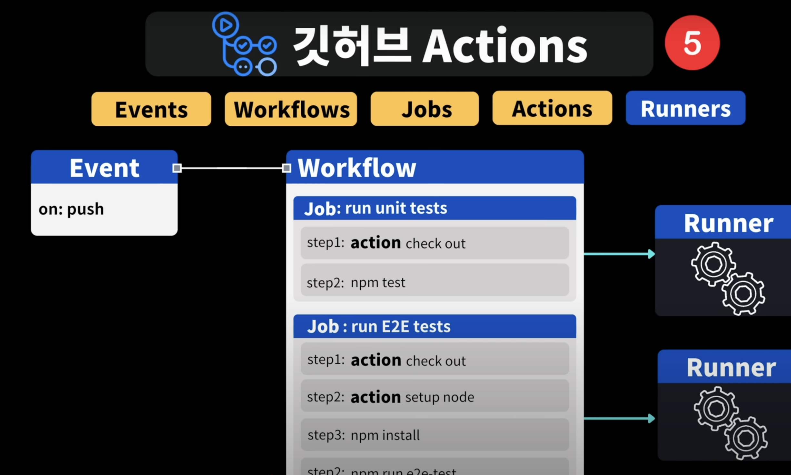

### 시작
프로젝트에 배포를 편리하게 하기 위해서 CI/CD를 도입하려고 했다. 처음에는 Jenkins를 고려했지만, 별도로 서버를 세팅하고 관리해야 하는 복잡함이 부담스러웠다. 반면 GitHub Actions는 저장소 안에서 바로 CI/CD를 구성할 수 있어 접근성이 훨씬 좋았다. 특히 소규모 프로젝트나 개인 프로젝트에서는 GitHub Actions가 훨씬 효율적이라고 판단했다. 깃허브 액션의 yml 파일을 작성하는 방법을 익히기 위해 이 글을 쓴다.


### 1. 깃허브 액션 이란?
깃허브에서 제공하는 CI/CD(Continuous Integration/Continuous Deployment) 자동화 도구이다. 이를 통해 코드에 변경 사항이 저장소에 푸쉬될때, 자동으로 빌드, 테스트, 배포를 진행할 수 있다.
.github/workflows/ 내에 YAML 파일을 사용하여 구성한다.

### 2. 깃허브 액션의 구성 요소


(출처)(드림코딩-제발 깃허브 액션🔥 모르는 개발자 없게해 주세요 🙏)

#### 2.1 이벤트(Events)
깃허브 액션을 실행 시키는 트리거이다. 즉, "언제 실행할 것인가"를 정의하는 부분이다. 이벤트를 통해 `워크플로우` 가 실행된다.
- `push` : 특정 브랜치에 코드가 푸쉬될 때 진행
- `pull_request` : PR이 생성되거나 변경될 때 실행
- `schedule` : 정해진 시간마다 실행
- `workflow_dispatch` : 수동으로 실행 -> 굳이 필요한가?

예시)
``` yaml
on: push #깃허브에 코드를 푸쉬할 경우 실행
```

#### 2.2 워크플로우(Workflows)
하나 이상의 `작업(Job)`으로 구성된 자동화 프로세스 전체를 의미한다.
.github/workflows/ 내에 YAML 파일을 사용하여 구성한다.

#### 2.3 잡(Jobs)
하나 이상의 `스텝(Steps)`로 이루어진 실행 단위이다.
워크플로우 내에 여러개의 잡을 정의할 수 있으며, 잡 사이에 독립적일 수도 의존적일 수도 있다.

- `runs-on` : 실행 환경 지정(가상 환경 VM)
	- `ubuntu-latest`,`windows-latest`, `macos-latest` : 리눅스, 윈도우, 맥os 모두 지원한다.
- `steps` : 작업 단계 정의
- `needs` : 특정 잡이 완료된 후, 다른 잡을 실행할 수 있도록 설정

예제)
1개의 워크플로우 안에 2개의 잡(build, test)

```yaml
name: Deploy workflow # 워크플로우 이름

on: 
  push: # push 이벤트 발생 시 실행

jobs:
  build: # 첫 번째 잡 이름
    runs-on: ubuntu-latest # 실행 환경
    steps:
      - name: 코드 다운로드
        uses: actions/checkout@v3

      - name: 빌드 실행
        run: echo "building the project..."

  test: # 두 번째 잡 이름
    needs: build # build 잡이 끝난 후 실행
    runs-on: ubuntu-latest
    steps:
      - name: 테스트 실행
        run: echo "running tests..."

```

>"이벤트, 워크플로우, 잡, 스텝" 정리
>이벤트가 발생하면, 워크플로우 안의 잡 안에 스텝들이 순차적으로 실행된다. 하나 이상의 잡이 존재할 경우, 잡 또한 순차적으로 실행된다.
{: .prompt-info}


#### 2.4 액션(Actions)
특정 기능을 수행하는 미리 만들어진 재사용 가능한 모듈이다.
깃허브 마켓 플레이스 에서 다양한 액션을 찾아 사용할 수 있다.

```yaml
name: Deploy workflow

on: 
  push:

jobs:
  deploy:
    runs-on: ubuntu-latest
    steps:
      - name: 저장소 체크아웃
        uses: actions/checkout@v3 
        # 저장소(리포지토리)를 가져온다
             
      - name: 노드 설치
        uses: actions/setup-node@v3 
        # node.js 환경설정

```

#### 2.5. 러너(Runners)
워크플로우를 실행하는 서버이다. 깃허브에서 제공하는 호스트 러너와 사용자가 직접 호스팅하는 셀프 호스칭 러너가 있다. 보통 호스트 러너를 사용한다.
잡에 `runs-on` 을 설정하여 사용한다.

- Github-hosted runner
	- 잡에 `runs-on` 을 설정하여 원하는 운영체제를 선택할 수 있음
		- `ubuntu-latest`,`windows-latest`, `macos-latest` 등을 제공
	- 깃허브에서 관리하므로 별도의 설정이 필요 없음
	- 무료 요금제에서는 사용량에 제한
- Self-hosted runner
	- 잡에 `runs-on` : `self-hosted` 로 사용
	- 사용자가 직접 서버를 설정하여 실행
	- 사내 서버, 클라우드 가상머신에서 실행 가능
	- 비용 절감이 가능하지만 유지보수가 필요함

### 3. 깃허브 액션 실행 흐름
1. 사용자가 특정 브랜치에 `push` or `pull request` 를 수행
2. 깃허브 액션이 해당 이벤트(`on:`)을 감지하여 워크플로우를 실행
3. 정의된 잡이 순차적 혹은 병렬로 실행
4. 각 잡은 여러 스탯을 수행하며, 액션을 실행하거나 명령어를 실행
5. 작업이 완료되면 실행 결과가 깃허브 UI에서 확인 가능


### 느낀 점
처음에는 runs-on 설정에 대해 이해하지 못했는데, 이 글을 작성하면서 하나의 가상환경을 설정하는 옵션임을 알게 되어 하나의 잡에서 하나의 가상환경을 설정하고, 이 가상환경 안에서 작동될 것들을 스텝으로 관리한다는 개념을 이해하게 되어 CI/CD 환경 구성을 이해할 수 있게 되었다.