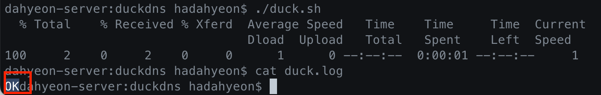
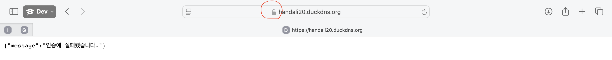

### 시작
한달이를 구글 플레이 스토어에 배포하던 중, 설정 창에서 https 를 사용하는 지 뭍는 질문이 나왔고 검색해보니 https 로 데이터를 전송해야 정상적으로 요청이 처리된다는 것을 알게 되었다. 따라서 플레이 스토어에 앱을 정상 등록 시키기 위해서 https 설정을 해주었다.

### 포트포워드 설정
iptime을 사용하고 있기 때문에, `http://192.168.0.1` 로 접속하여 서버의 443번 포트를 열어준다.

### https 설정시 발생한 문제점
자체 인증방법은 즉, 자체적으로 인증서를 발급하고 등록하는 방법으로 처음에 진행했다. 이 방법으로 진행했더니 웹 브라우저에서 위험한 사이트라고 막힐 뿐만 아니라, 리엑트 네이티브에서 네트워크 오류가 발생했다. 따라서 certbot을 사용하여 인증서를 발급받으려고 했으나... 현재 사용 중인 `iptime.org` 도메인에서 Let's Encrypt 인증서를 막고 있어서 해당 방법은 사용할 수 없음을 알게 되었다.

### 새로운 도메인 생성
새로운 도메인을 얻기 위해, 무료로 도메인을 만들 수 있는 사이트에 방문했다.
```
https://www.duckdns.org/domains
```
위 사이트에서 현재 외부 ip를 등록하고, 도메인명을 설정하여 도메인을 발급받는다.
`handali20.duckdns.org` 가 앞으로 사용할 새로운 도메인이다.

외부 ip가 동적으로 변경되어도 도메인을 유지할 수 있는 서비스를 duckdns에서 제공하기 때문에 설정해주었다.
설정방법은 아래 사이트에 나온 대로 실행하면 된다.
https://www.duckdns.org/install.jsp

```
mkdir -p ~/duckdns
cd ~/duckdns
```

```
nano duck.sh
```

```
echo url="https://www.duckdns.org/update?domains=handali20&token=여기에_토큰_입력&ip=" | curl -k -o ~/duckdns/duck.log -K -
```
토큰은 https://www.duckdns.org/domains 이 사이트에서 얻을 수 있다.

```
chmod 700 ~/duckdns/duck.sh
```

```
crontab -e
```

```
*/5 * * * * ~/duckdns/duck.sh >/dev/null 2>&1
```


```
./duck.sh
```

```
cat duck.log
```

ok가 나오면 성공한 것이다.

### nginx 도메인 설정
새로운 도메인을 엔진엑스에 등록해준다.
```
sudo nano /usr/local/etc/nginx/nginx.conf
```

```
server {
    listen 80;
    server_name handali20.duckdns.org;

    location / {
        proxy_pass http://localhost:8080; # Spring Boot
        proxy_set_header Host $host;
        proxy_set_header X-Real-IP $remote_addr;
        proxy_set_header X-Forwarded-For $proxy_add_x_forwarded_for;
        proxy_set_header X-Forwarded-Proto $scheme;
    }
}
```

### https 인증서 발급
이제 정상적으로 certbot 인증서가 발급된다.
```
sudo certbot --nginx -d handali20.duckdns.org
```

### 인증서 자동 갱신 설정 (cron)
Let's Encrypt 인증서는 90일짜리이므로 자동 갱신을 설정한다.
```
sudo crontab -e
```
다음 줄 추가 (하루 1번 새벽 3시에 갱신 시도)
```
0 3 * * * /usr/local/bin/certbot renew --quiet --post-hook "nginx -s reload"
```


### nginx 에 인증서 등록
인증서를 등록하여 https 연결을 허용한다.
http로 접속해도 https 를 사용하도록 등록한다.
```
sudo nano /usr/local/etc/nginx/nginx.conf
```

```
server {
    listen 80;
    server_name handali20.duckdns.org;

    # Let's Encrypt 인증서 발급용 HTTP 인증 경로
    location /.well-known/acme-challenge/ {
        root /var/www/certbot;
    }

    # HTTP로 접근 시 HTTPS로 리다이렉트
    location / {
        return 301 https://$host$request_uri;
    }
}

server {
    listen 443 ssl;
    server_name handali20.duckdns.org;

    # 인증서 경로 (Let's Encrypt)
    ssl_certificate     /etc/letsencrypt/live/handali20.duckdns.org/fullchain.pem;
    ssl_certificate_key /etc/letsencrypt/live/handali20.duckdns.org/privkey.pem;

    # React Native에서 Spring Boot로 요청 프록시
    location / {
        proxy_pass http://localhost:8080;
        proxy_set_header Host $host;
        proxy_set_header X-Real-IP $remote_addr;
        proxy_set_header X-Forwarded-For $proxy_add_x_forwarded_for;
        proxy_set_header X-Forwarded-Proto $scheme;
    }
}
```

```
sudo nginx -t
```
successful 나오면 문법 검사 완료이다.

```
brew services restart nginx
```
엔진엑스를 재시작 한다.

```
brew services
```
위 명령어를 쳤을 때, nginx가 started 상태이면 nginx 설정이 성공적으로 진행된 것이다.

### https 접속 확인
브라우저에 아래 url 로 접속하여, 자물쇠 모양이 뜬다면 성공이다.
스프링시큐리티 설정을 했기 때문에, 서버에 정상 접속하여 에러처리가 된 것까지 확인 할 수 있다.
```
https://handali20.duckdns.org
```

